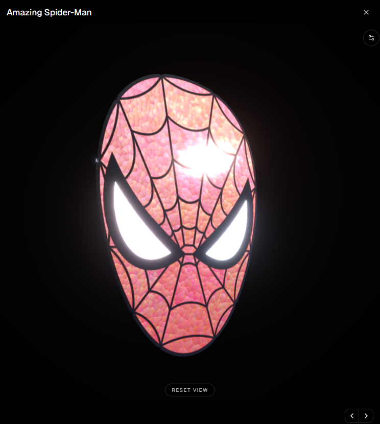
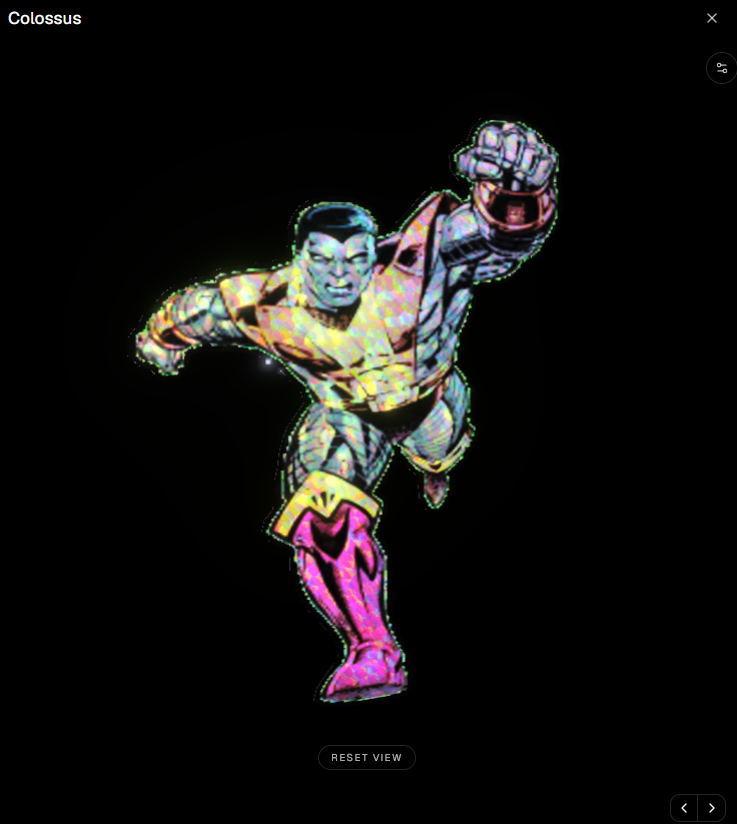
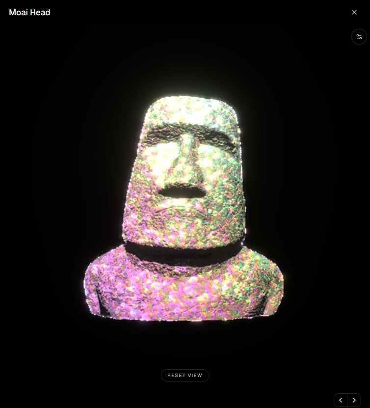

# Holographic Sticker

Open-source dump of the **die-cut holographic sticker** stack used on [thegreaterengine.xyz/collectibles](https://thegreaterengine.xyz/collectibles).

This is **reference source**, not a drop-in npm package. Paths and `@/` imports match the portfolio app — copy what you need into a Next.js + React Three Fiber project.

<p align="center">
  
  
  
</p>

<p align="center"><em>Amazing Spider-Man · Colossus · Moai Head — live foil viewer screenshots</em></p>

---

## What this is

A vinyl-style **die-cut sticker** in WebGL:

1. Contour → thin extruded mesh + a **single** reverse face (no double-back ghosting)
2. Artwork → baked foil data maps (`holo-detail`, `holo-normal`, masks, …)
3. `MeshPhysicalMaterial` patched with `onBeforeCompile` for prismatic foil
4. Invisible orbiting key light + bloom for specular “blind flash”
5. Live **Play** panel: pattern modes, foil, sparkle, glare, backdrop, reroll light
6. Optional **Try it here** client bake (browser-only logo mode — no upload)

---

## Stack

| Piece | Tech |
| --- | --- |
| Viewer | React Three Fiber, Drei, postprocessing bloom |
| Material | Three.js `MeshPhysicalMaterial` + GLSL inject |
| Bake (server) | Sharp (`bake-sticker-assets.ts`) |
| Bake (browser) | Canvas / ImageData (`client-bake-logo.ts`) |
| UI shell | Next.js App Router components (lightbox, try-it, countdown) |

**Peer-ish deps** (as used in production): `three`, `@react-three/fiber`, `@react-three/drei`, `@react-three/postprocessing`, `framer-motion`, `sharp` (Node bake only).

---

## Repo layout

```
src/
  createStickerGeometry.ts    # die-cut + reverse face
  bake-sticker-assets.ts      # server bake (comic | logo)
  client-bake-logo.ts         # browser bake for Try it here
  HoloFoilMaterial.ts         # foil shader + live motifs
  StickerModel.tsx            # meshes + textures
  StickerViewer3D.tsx         # canvas, sun, bloom, export
  holoSettings.ts             # Play defaults + pattern ids
  StickerHoloSettingsPanel.tsx
  BackdropColorField.tsx
  CollectibleLightbox.tsx     # modal (lazy-loads viewer)
  CollectibleTryIt.tsx
  TryItCountdown.tsx          # availability window
  CollectiblesPageContent.tsx
  collectibles.ts
scripts/
  prepare-sticker-assets.mjs  # CLI local bake helper
docs/
  screenshots/                # example renders
  GUIDE.md                    # step-by-step walkthrough
```

---

## Pattern modes (live)

Facets · Stripes · Stars · Splatters · Pearl · Glitter · **Emoji** · **Brushes** · **Pixels**

Controlled in `holoSettings.ts` / `HoloFoilMaterial.ts` via `uPatternMode` + scale / density / seed. Facets leave baked Voronoi maps alone; other modes stamp a procedural mask over the rainbow response.

---

## Bake modes

| Mode | Use |
| --- | --- |
| `comic` | Red/white panes + black ink lead (Spidey-tuned) |
| `logo` | Auto-pad, content silhouette, preserve brand colors, milder foil |

Server: `bake-sticker-assets.ts`  
Browser (no upload): `client-bake-logo.ts`

---

## Important notes

- **Quality first** — do not downscale / recompress production WebGL foil maps for “perf.” Soft normals kill the look.
- **Lazy-load** Three.js (`next/dynamic`, `ssr: false`) from the lightbox / try-it entry so the gallery page stays light.
- **One reverse face** — strip the extrusion back cap; never stack two backs.
- Try-it availability is gated by `TryItCountdown.tsx` (locks after the configured deadline).

---

## Walkthrough

See **[docs/GUIDE.md](docs/GUIDE.md)** for the same step-by-step explanation as the in-site Build Guide.

Live demo: [thegreaterengine.xyz/collectibles](https://thegreaterengine.xyz/collectibles)

---

## License

**Copyright © 2026 Joshua Waldo** ([@Salutatorian](https://github.com/Salutatorian)).

This repository is released under the [Apache License 2.0](LICENSE). You may use, copy, modify, and distribute the code under those terms. Attribution notices in [`NOTICE`](NOTICE) must be retained in derivative works.

Live demo / origin: [thegreaterengine.xyz/collectibles](https://thegreaterengine.xyz/collectibles)

Screenshots and example art may depict third-party characters used for demonstration on a personal portfolio; don’t treat those images as freely redistributable brand assets.
